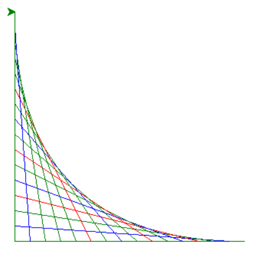

# Colorful Line Pattern with Turtle Graphics

A simple Python project that uses the built-in Turtle Graphics library to create a colorful geometric line pattern. The program draws multiple lines with randomly selected colors, producing a visually appealing design.

## Features

* Uses Python's built-in Turtle Graphics module
* Draws a geometric line pattern
* Randomly selects colors for each line
* Simple and beginner-friendly code
* No external libraries required

## Technologies Used

* Python 3
* Turtle Graphics
* Random

## How It Works

1. The turtle starts at the right side of the screen.
2. A line is drawn toward the left side.
3. After each line, the starting position moves closer to the center.
4. A random color is selected from:

   * Red
   * Green
   * Blue
5. The process repeats until the pattern is complete.

## Requirements

* Python 3.x

No additional packages are required because Turtle is included with the Python standard library.

## How to Run

Run the script using:

```bash
python draw.py
```

A Turtle Graphics window will open and display the generated pattern.

## Project Structure

```text
turtle-line-pattern/
│
├── draw.py
├── README.md
└── LICENSE
```

## Example Output

The program generates a colorful geometric pattern consisting of multiple intersecting lines with randomly chosen colors.



## Customization

You can modify the following variables to create different patterns:

```python
x = 300      # Starting width
n = 20       # Distance between lines
color = ['red', 'green', 'blue']
```

Examples:

* Add more colors
* Increase the drawing size
* Change the spacing between lines
* Experiment with different coordinates

## Learning Objectives

This project demonstrates:

* Loops (`for`)
* Lists
* Random number generation
* Turtle Graphics
* Basic coordinate systems
* Drawing with Python

## Future Improvements

* Allow users to choose colors
* Add more geometric patterns
* Save drawings as image files
* Add animation effects
* Create a graphical menu

## License

This project is licensed under the MIT License.

## Author

**Mohammad Reza Bakhshandeh**

Electrical Engineering (Electronics) Graduate

Interested in Python Development, Computer Vision, Machine Learning, and Artificial Intelligence.
